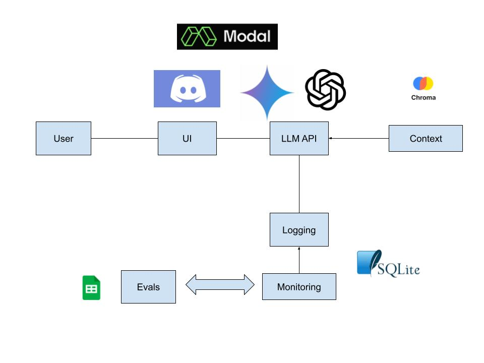

# Discord Chat Bot

A Python-based Discord bot using RAG and Modal to answer questions about the transcription of the live sessions of the course [Building LLM Applications for Data Scientists and Software Engineers](https://maven.com/hugo-stefan/building-llm-apps-ds-and-swe-from-first-principles)


Model design



## Features
- Deployed using Modal for serverless execution.
- Connects to Discord using the Discord Gateway API to listen for messages.
- Loads a workshop transcript from a `.vtt` file for context, storing embeddings in ChromaDB.
- Uses OpenAI's GPT model (via `vector_emb.py`) to answer user questions based on the transcript context.
- Responds to mentions (@bot) and messages containing "bot".
- Creates threads for each question to keep conversations organized.
- Collects user feedback on responses via text replies in threads.
- Logs all interactions in a SQLite database stored in a persistent Modal Volume.
- Supports a web interface for monitoring bot interactions using Datasette (requires separate setup, see `deploy_datasette.py`).
- Includes an evaluation system (`src/eval.py`) to test bot responses against predefined questions.

## Getting Started

### Prerequisites
- A Discord bot token and client ID (public key not needed for message-based bots).
- An OpenAI API key.
- A Weights & Biases API key (for logging, optional but recommended).
- Modal account and CLI installed ([Modal Setup Guide](https://modal.com/docs/guide/installation)).
- Python 3.11 or later.

### Installation
1. Clone the repository:
   ```bash
   git clone https://github.com/sotoblanco/discord-chat-bot.git
   cd discord-chat-bot
   ```

2. Install local dependencies (optional, primarily for evaluation/local testing):
   ```bash
   pip install -r requirements.txt
   ```

3. Set up Modal Secrets:
   - Create a Modal secret named `openai-secret` with your `OPENAI_API_KEY`.
   - Create a Modal secret named `discord-secret-2` with your `DISCORD_BOT_TOKEN` and `DISCORD_CLIENT_ID`.
   - (Optional) Create a Modal secret named `wandb` with your `WANDB_API_KEY`.
   ```bash
   modal secret create openai-secret OPENAI_API_KEY=<your-openai-api-key>
   modal secret create discord-secret-2 DISCORD_BOT_TOKEN=<your-discord-bot-token> DISCORD_CLIENT_ID=<your-discord-client-id>
   # Optional
   modal secret create wandb WANDB_API_KEY=<your-wandb-api-key>
   ```
   *(Note: DISCORD_PUBLIC_KEY is not needed for message-based bots)*

4. Place the `.vtt` transcript file in the `data/` directory (e.g., `data/WS1-C2.vtt`). The code currently expects `WS1-C2.vtt`.

### Usage

#### Quick Deploy (Recommended)
Use the deployment script for an easy setup:
```bash
python deploy.py
```

This script will:
- Check prerequisites (Modal CLI, data files, authentication)
- Guide you through setting up secrets
- Register the slash command
- Deploy the bot
- Provide next steps

#### Manual Deployment

1.  **Install Modal CLI:** 
    ```bash
    pip install modal
    modal setup
    ```

2.  **Set up Modal Secrets:**
    ```bash
    modal secret create openai-secret OPENAI_API_KEY=<your-openai-key>
    modal secret create discord-secret-2 \
      DISCORD_BOT_TOKEN=<your-bot-token> \
      DISCORD_CLIENT_ID=<your-client-id>
    ```

3.  **Deploy and Start the Bot:** 
    ```bash
    # Option 1: Use the dedicated start script (recommended)
    python start_bot.py
    
    # Option 2: Manual deployment
    modal deploy src/modal_discord_bot.py
    modal serve src/modal_discord_bot.py::serve_discord_bot
    ```

4.  **Invite the Bot:** Go to the **Installation** section in the Discord Developer Portal and use the provided link to invite the bot to your server.

5.  **Interact:** Mention the bot in any channel to ask questions.
    ```
    @botname What is Modal?
    ```
    Or send a message containing "bot":
    ```
    Hey bot, can you help me with something?
    ```

### Evaluating Bot Responses
To test the bot's question answering capabilities with predefined questions:

```bash
# Ensure OpenAI API key is set locally or via .env for this script
export OPENAI_API_KEY=<your-openai-api-key> 
# Or add it to a .env file
python src/eval.py
```

## Code Overview

### Key Components
1.  **Modal Application (`modal_discord_bot.py`)**:
    - Defines the Modal app, image, secrets, and persistent volume.
    - `fetch_api`: Modal function to get answers from OpenAI using context from `vector_emb.py`.
    - `reply`: Modal function orchestrating the question answering and feedback button response.
    - `handle_feedback`: Modal function to process user feedback from buttons.
    - `create_slash_command`: Modal function to register the `/api` command with Discord.
    - `web_app`: FastAPI application served by Modal, handling incoming Discord interactions (slash commands, button clicks) via webhooks. Authenticates requests using Discord's public key.
    - `authenticate`: Verifies incoming request signatures from Discord.

2.  **Vector Embeddings & RAG (`vector_emb.py`)**:
    - Handles chunking the transcript (`process_transcript.py`).
    - Generates embeddings using OpenAI.
    - Stores and retrieves chunks from ChromaDB (`chroma_db/`).
    - Provides context (`get_context_for_question`) for the LLM based on question similarity.
    - Contains the core logic (`answer_question`, `llm_answer_question`) for generating answers based on retrieved context.

3.  **Database (`database.py`)**:
    - Handles SQLite database operations (`track_db.py` or Modal Volume path).
    - Logs interactions (questions, responses, feedback).
    - Initializes the database schema.

4.  **Evaluation (`eval.py`)**:
    - Script for evaluating bot performance with test questions from `data/eval/questions.txt`.
    - Uses the RAG pipeline from `vector_emb.py`.

5.  **Datasette Deployment (`deploy_datasette.py`)**:
    - Separate Modal app to deploy a Datasette instance for viewing the interaction logs stored in the Modal Volume.

### File Structure
- `src/modal_discord_bot.py`: Main script for the Modal-deployed Discord bot and webhook handler.
- `src/vector_emb.py`: RAG pipeline, embedding generation, ChromaDB interaction, context retrieval.
- `src/database.py`: SQLite database interaction logic.
- `src/process_transcript.py`: VTT transcript parsing and chunking.
- `src/eval.py`: Evaluation script.
- `src/deploy_datasette.py`: Script to deploy Datasette for log viewing.
- `track_db.py`: (Potentially legacy or for local use) Database interaction script.
- `chroma_db/`: Directory for persistent ChromaDB vector store.
- `data/`: Contains transcript files (`.vtt`) and evaluation data.
- `requirements.txt`: Python dependencies for local execution/evaluation.
- `README.md`: This file.

## Creating a Discord bot

Go to the [Discord developer portal](https://discord.com/developers/applications) and sign in

Click on the new application and assign a name


Go to the bot section and allow messages. You can assign the permissions you need for your bot. In this case, we add:

- Send messages
- Create public threads
- Send messages in threads
  


This combination of permissions generates a combination of numbers to let you know the permission of your bot


Go to installation section and you will have a link provided by discord


We need this link to add our bot to the server

The link provided by discord is: https://discord.com/oauth2/authorize?client_id=xxxxxxxxxxxxxxxxxxx

You need to add 2 more parameters:

https://discord.com/oauth2/authorize?client_id=xxxxxxxxxxxxxxxxxxx&permission=xxxxxxxxxxx&scope=bot

- ``client_id`` is provided by Discord on the link
- The ``permission`` is the combination of numbers that identify the permissions of the bot. The number for only messages is 2048, since we are adding send messages, create public threads and meesage in public threads we have this number: 309237647360
- ``scope`` the behavior that your application will have, in our case is bot

The links needs to be secret, everyone can use the bot with the link

Paste the link in your browser and it will take you to this screen in which you accept the bot and choose the server you want to added, it will let you know the permissions it has


Now it's set, it will appear on your server, as we are testing a RAG application it is prompted to only answer based on the context


## Deployment

This application is designed to be deployed using [Modal](https://modal.com/).

1.  **Ensure Prerequisites:** Make sure you have a Modal account, the Modal CLI installed, and your Modal secrets (`openai-secret`, `discord-secret-2`) configured as described in the Installation section.
2.  **Register Slash Command:** If you haven't already, register the command:
    ```bash
    modal run src/modal_discord_bot.py::create_slash_command
    ```
3.  **Deploy the Bot:**
    ```bash
    modal deploy src/modal_discord_bot.py
    ```
    This command packages the code, dependencies, and configuration and deploys it to Modal's infrastructure. It will output the webhook URL for the running application.
4.  **Configure Discord Endpoint:** Copy the webhook URL (ending in `/api`) provided by Modal and paste it into the **Interactions Endpoint URL** field in your Discord application settings (General Information tab). Save the changes.
5.  **Invite Bot:** Use the installation link from the Discord Developer Portal (**Installation** section) to add the bot to your server.

The bot will now be running on Modal and responding to `/api` commands in your server. Modal handles scaling and infrastructure automatically.

**(Optional) Deploy Datasette Log Viewer:**
To view the interaction logs stored in the Modal Volume, deploy the separate Datasette application:
```bash
modal deploy src/deploy_datasette.py
```
This will provide a separate URL to access the Datasette web interface for browsing the `interactions.db` database.

**(Optional) Monitoring:**
Modal provides its own monitoring and logging through the Modal UI. External services like UptimeRobot are generally not needed for Modal apps unless you want additional external checks on the webhook endpoint itself.

## Contributing
Contributions are welcome! Feel free to open issues or submit pull requests.

## License
This project is licensed under the MIT License. See the `LICENSE` file for details.
